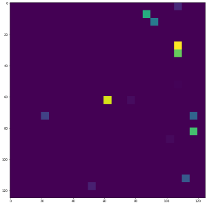
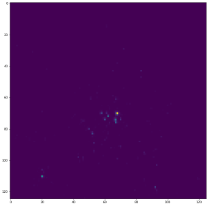
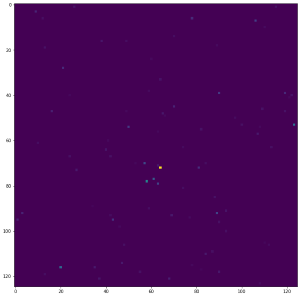

# GSoC 2022 Progress Report
This is the official repository for my GSoC 2022 project with ML4SCI.
Titled: **Vision Transformers for End-to-End Particle Reconstruction for the CMS Experiment.**
This project aims to add Vision Transformer and related models to the already present CMS E2E
pipeline for more accurate analysis and classification. 
<ins>This repository is still under development and may contain some unnecessary files</ins>. 
Note: Till completion, this report will act as **progress report** for the project and will be converted
to detailed documentation once the development phase is over
***
### Problem Statement
If the reader knows what they are dealing with, I would advise proceeding further.

In this project, we are working with multi-detector images corresponding to actual maps of low-level
energy deposits in the detector for various types of particle collision events in CMS(CERN).
In layman's terms, we use the data generated by the detectors in the CMS experiment to 
learn more about the particles and analyse them. The used in our case are Monte-Carlo simulated 
data. We are using the following data and constructing images(jet images) out of them, and using
Machine Learning to analyse(in our case Classify) them. Different types of detectors or sensors
produce different kinds of data or, in our case, jet images.

These are some jet images for the Quarks and Gluons
| HCAL | ECAL | TRACKS |
| ---- | --- | --- |
|  |  |  |

***
### Approach
Previously there have been attempts to classify the images with ResNet-based architectures. In our case
we will use Transformers, namely Vision Transformers and various state-of-the-art Transformer based models to
achieve a somewhat higher score than the previous attempts.

The following models were tested for the task:-
* [Vision Tranformers](https://arxiv.org/abs/2010.11929)
* [Swin Transformers](https://arxiv.org/abs/2103.14030)
* [CoAt nets](https://arxiv.org/abs/2106.04803)
* [MaxViT](https://arxiv.org/abs/2204.01697)
* [DaViTs](https://arxiv.org/abs/2204.03645)
* [Efficient Nets](https://arxiv.org/abs/1905.11946)
* [ResNets(ResNet 15)](https://arxiv.org/abs/1512.03385) 

Note: The model Vision Transformers was very unstable for our use case and hence was discarded
***
### Input PipeLine
Inputs PipeLine is a crucial component when building Machine Learning Model. Moreover
since here we are dealing with a large number of files (~700k), a good and efficient pipeline
is a must for scalability.

#### PipeLine 1 [Depreciated]
This pipeline was majorly used to train PyTorch-based models on GPUs. Since
GPUs can deal with somewhat less efficient pipelines, and we need to have the model 
up and running as early as possible this was chosen. 

The pipeline is shown below.

The codes for converting the parquets to data along with the pre-processing can
be found [here](./Dataset_Finder/Try-2/runner.py)

#### PipeLine 2
This pipeline is built keeping in mind performance.
This pipeline is robust enough to serve data to a **TPU** without bottlenecking.
It is an extension of the previous pipeline. We take the .png files made by the
previous pipeline and convert them to TFRecords for faster performance. The TFRecords files 
are sharded in parts of 10240 images for each file. The files are later read by the tf.data API to prevent 
even the slightest bottleneck. This pipeline is utilised for training on TPUs.

The codes for converting the .png files to TFRecord files can be found [here](./TFRecord/TFRecord_Creater.ipynb)

### Data Preprocessing
Since the quality of Input data is of uttermost importance for any model. We have spent quite some time(~1 week)
to simply understand it and find the most reliable pre-processing technique.
***
The entire experimentation Repository can be found [here]
***
Each of them has different pre-processing techniques employed along with code to split and save the model.
The readme file over there explains them in detail.
To find the performance of the model on different pre-processing techniques, we trained it separately for every
one of them.

#### Things we experimented with:-
* Clipping extreme peaks[max suppression] in the data to highlight more subtle feature
* Testing the amount of zero suppression which suits the best.
For max suppression, we clipped the data channel-wise for every single image using their standard deviations.
For zero suppression, we globally clipped the min value up to a certain range,

#### Results
* For Zero suppression, we could not come to any conclusion as all the models performed equally well; hence we stuck to what was originally chosen; 0.001
* For Max Suppression, we indeed got interesting results:-  

| 50 | 100 | 200 | 500 | 
| --- | --- | --- | --- |
|0.8124 | 0.8085 | 0.8068 |0.8047 |

*The metric reported is AUC for different Standard Deviations* 

The repository with the final pre-processing codes can be found [here](https://github.com/dc250601/GSOC/tree/main/Dataset_Finder) 
The entire WandB logs can be found [here](https://wandb.ai/dc250601/Clipped%20dataset%20Finder_try2?workspace=user-dc250601) for further inspections

### Models

#### Visual Image Transformers(ViT)
*The code and results of this model are not added as no stable version of it could be defined
and the defined models faced the problem of extreme gradient explosions and model overfitting, more experiments
will be done later.* 

### Swin Transformer
Although ViTs were very unstable and were closed to unusable, Swin was quite effective in our case.
We initially obtained an AUC score of 0.7847
A much higher score was later obtained(0.8082) from the above model when we trained will some more data and with better data Augmentation
as described in the previous section.
The WandB logs of the initial run can be found [here](https://wandb.ai/dc250601/kaggle_Auc_fixed/runs/2m7wv9u6?workspace=user-dc250601) 
The code can be found in the following [repository](./Swin/Swin.ipynb). 

### CoAt Nets 
CoAt Nets are built by simply replacing multiple stages of the vanilla ViT with Mobinet blocks. But since the initial layers are Convolution 
layers, the model can have some inbuilt bias of Conv layers and also possesses the flexibility of ViTs as it has both of the layers present in it.
The CoAt Nets, when trained, shattered the previously set record by the ResNet-15 by quite some margin.
The CoAt Nets gave an AUC score of 0.8142.
The WandB logs of the run can be found [here](https://wandb.ai/dc250601/Total_dataset/runs/2lk1n956?workspace=user-dc250601) 
The code can be found in the following [repository](./CoAt_Full_dataset/master.py).

### MaxViTs and DaViTs
Both of these models were trained to see the scores of the hybrid architecture of ViTs and Conv Nets.
But neither of them could live up to our expectations since they both suffered from problems somewhat similar to the ViT and performed poorly.
The logs can be found [here](https://wandb.ai/dc250601/New_Models?workspace=user-dc250601)
The code for MaxViT lies [here](https://github.com/dc250601/GSOC/tree/main/Ensemble/MaxViT) 
The code for DaViTs lies [here](https://github.com/dc250601/GSOC/tree/main/Ensemble/DaViT)

### ResNet-15 
This model was simply built to benchmark with our new models. Since our project majorly deals with Transformers, we spent little time running
and optimising them.
Still, the code can be found [here](ResNet/ResNet.ipynb) 
The logs are [here](https://wandb.ai/dc250601/kaggle_Auc_fixed/runs/arhxi56z?workspace=user-dc250601)
*This code underperforms than what was claimed in the paper since only 1/5 th of the data was used to train this, and we did not extend our trial 
for larger datasets since we wanted to see how this model scales with low data.

### EfficientNet
This model is also a popular model. This model was trained during the pre-GSoC period, but since we are comparing different models, the [link](https://github.com/dc250601/CMS-GSoC-2022/tree/main/Common%20-%20II) to this
is also provided

### <ins>Hybrid Swin</ins>
Although the CoAt net architecture seems to be the highest performing model for our task, we still have a problem associated with it. ViT-like backbones are 
very unstable for our use case. Although all the above models are Hybrids, they still contain ViTs as their backbone. The Hybrid nature totally offsets the adverse
effects of ViTs when we use small-sized CoAt-Nets(CoAt-0), but once we start scaling them, we again start facing problems of gradient explosion and other adverse 
effects similar to what we saw in ViTs.
The fact is evident when we see the CoAt-1 model training [graphs](https://wandb.ai/dc250601/Coat1?workspace=user-dc250601)
The metrics drop further when CoAt-2 is employed. This shows that CoAts are not scalable in our case.
This led us to completely remove the ViT blocks from the CoAts and replace them with Swin blocks.
This led to a much more stable training, as can be seen in the following [graph](https://wandb.ai/dc250601/Ensemble/runs/21zil3cn?workspace=user-dc250601)
The training of the above mode is highly stable and is done in stages. All the codes related to the above custom model, along with the training script, can
be found in the following [repository](Ensemble/Eff_Swin/model.py)

