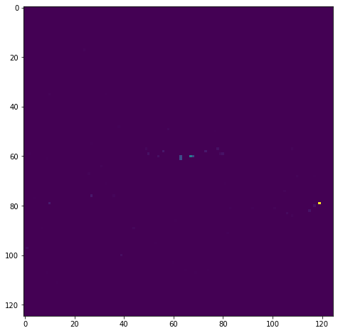
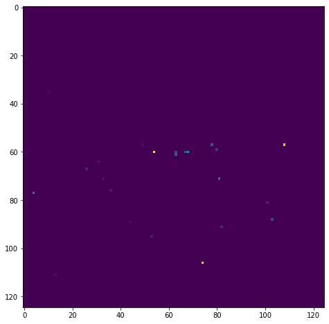
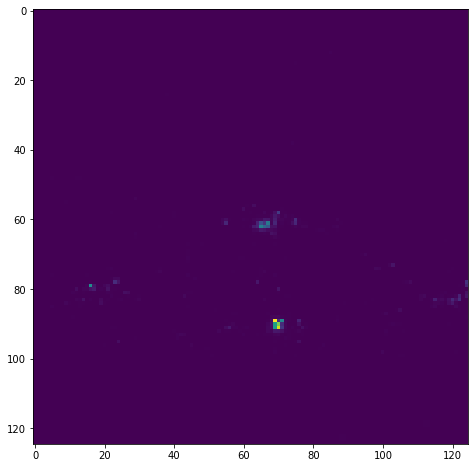
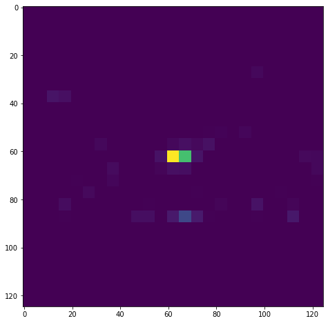
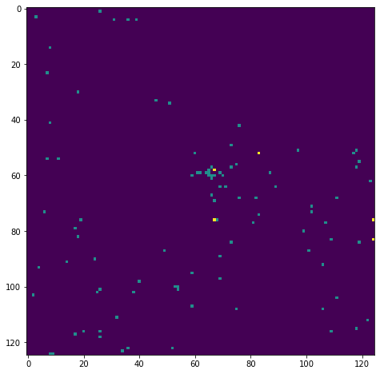
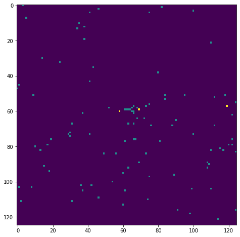
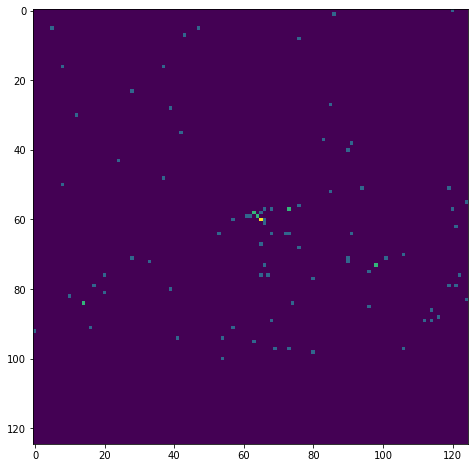
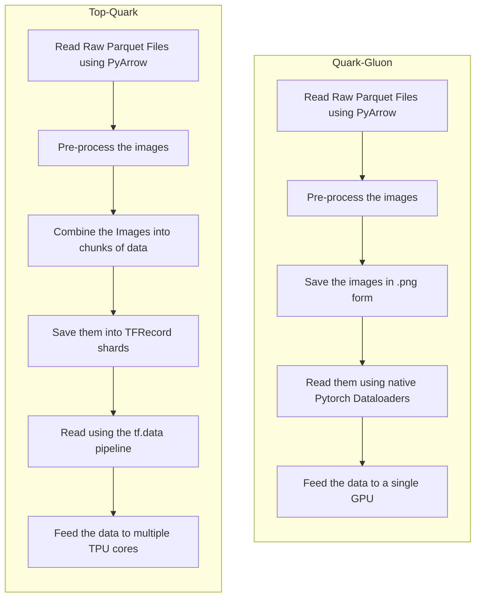
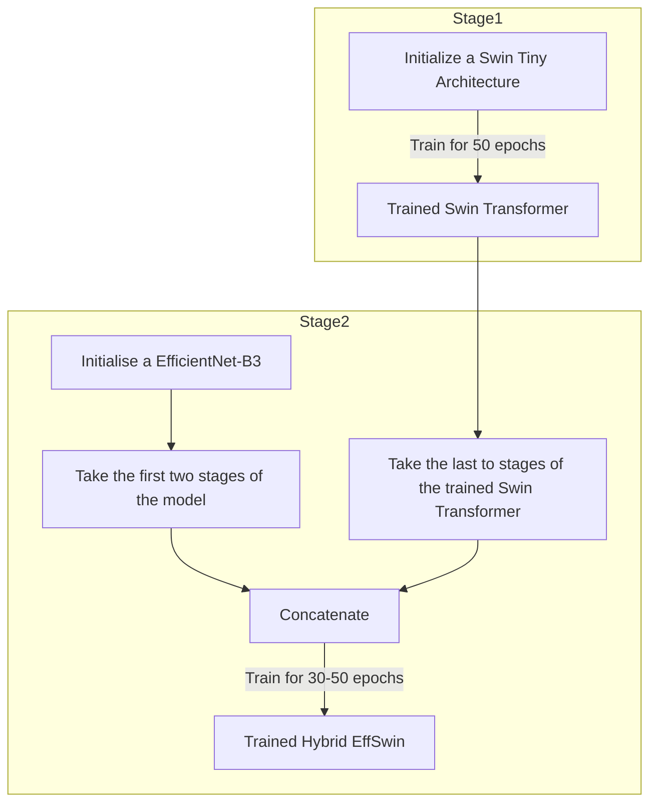

<h1 align="center">
Vision Transformers for End-to-End Particle Reconstruction for the CMS Experiment</br>
</h1>
<div align="center">

[](https://opensource.org/licenses/MIT)
[](https://github.com/firstcontributions/open-source-badges)
[](https://badge.fury.io/py/quple)

Official Repository for Google Summer of Code 2022.</br>
The main purpose of this project
is to explore the use of Vision Transformers in the domain of particle physics.</br>.</div>
<p align="center"></p>

***

## Table of Contents
- [Installation](#installation)
- [Abstract](#abstract)
- [Introduction](#introduction)
- [Data Pre-processing](#data-pre-processing)
- [Training](#training)
  * [Pipelines](#pipelines)
  * [Models](#models)
- [Results](#results)
  * [Inference](#inference)
- [Notebooks and Docs](#notebooks-and-docs)
- [References](#references)
- [Acknowledgement](#acknowledgement)
- [Contributing and Reporting](#contributing-and-reporting)


## Installation

```shell
!git clone https://github.com/dc250601/GSOC.git
%mv GSOC Transformers
%cd Transformers
```
## Abstract
If the reader knows what they are dealing with, I would advise proceeding further.

In this project, we are working with multi-detector images corresponding to actual maps of low-level
energy deposits in the detector for various types of particle collision events in CMS(CERN).
In layman's terms, we use the data generated by the detectors in the CMS experiment to 
learn more about the particles and analyse them. The used in our case are Monte-Carlo simulated 
data. We are using the following data and constructing images(jet images) out of them, and using
Machine Learning to analyse(in our case Classify) them. Different types of detectors or sensors
produce different kinds of data or, in our case, jet images.

This a sample dataset in the Quark-Gluon dataset

| HCAL | ECAL | TRACKS |
| ---- | --- | --- |
|  |  |  |


This is a sample datapoint in the Top-Quark dataset


|  |  |  |  |
| ---- | --- | --- | --- |
|  |  |  |  |

***
## Introduction
Previously there have been attempts to classify the images with ResNet-based architectures.
In our case we will use Transformers, namely Vision Transformers and various state-of-the-art
Transformer based architectures to achieve a somewhat higher score than the previous attempts.
To see if our hypothesis is indeed true and the ViT are performing better we have tested the models
across two different datasets namely the **Quark-Gluon** dataset and the **Boosted Top-Quark** dataset.
Since the two datasets were quite different from one another two different approaches were used in training
and deploying them. The exact process is decribed below.

## Data Pre-processing
ViTs are very sensitive to data pre-processing techniques. It has often been seen that even things like Image Interpolation Techniques, if not done properly, can adversely affect the performance of Transformers-based models. In our case, the data is directly sourced from CMS Open Data, and the outputs(pixel) can be arbitrarily large for a single detector(calorimeter) hence proper normalization techniques are employed.
We employ the following steps to ensure that the smaples or our datapoints are properly normalised and free from outliers:
* Zero suppression for any value under 10^-3.
* Channel Wise Z-score Normalisation across batches of size 4096.
* Channel Wise Max value clipping with clip value set equal to 500 times the standard deviation of the pixel values.
* Sample wise Min Max scaling.
Although the pre-processing is same for both the datasets but the input pipelines are vastly difference due to the training environment and computational challenges.

The following tutorials will help the reader to generate the processed data for training.
- Quark-Gluon(.png type dataset)
  * [](https://colab.research.google.com/drive/1baX8Xk1vY6sD9_RaTSLwRq_lHZEHeS60?usp=sharing)
- Boosted Top-Quark(TFRecord dataset)
  * [](https://colab.research.google.com/drive/1TuF7G06Tx9GpR4Sbou8hsSj9lXYPSCgk?usp=sharing)

## Training
The Quark Gluon models are trained on a 2080Ti using Pytorch and the input data is in form of .png . While for the Top-Quark dataset we have used TPU-V3s for training. The models for Top-Quark dataset is written in Tensorflow and the input data is in form of TFRecords. The following diagrams best describe the input pipelines for both the types of datasets.

### Pipelines


### Models
The we trained a bunch of different models to get a basic understanding of the problem which includes

* [Vision Tranformers](https://arxiv.org/abs/2010.11929)
* [Swin Transformers](https://arxiv.org/abs/2103.14030)
* [CoAt nets](https://arxiv.org/abs/2106.04803)
* [MaxViT](https://arxiv.org/abs/2204.01697)
* [DaViTs](https://arxiv.org/abs/2204.03645)
* [Efficient Nets](https://arxiv.org/abs/1905.11946)
* [ResNets(ResNet 15)](https://arxiv.org/abs/1512.03385)</br>
* Hybrid EffSwin(Custom Architecture)

But out off the above models only a few stood out which are-
* Swin Transformers
* CoAt Nets
* Hybrid EffSwin
The above three models performed the best although Swin Transformer performed which worse to that of CoAt and Hybrid architetcure still it is kept under considersation due to the fact that the Hybrid EffSwin is built using it.

The model Hybrid EffSwin can be easily made by combining Swin Transformers with EfficientNet-B3. The following diagram best represent it.

The following Tutorial will help the reader to Train the models if they want
- Tutorial to train CoAt-Net(Torch-GPU)
  * [](https://colab.research.google.com/drive/1xqHt1HvcpmrKyQDm5Dh4VYAdA8AiLyBN?usp=sharing)
- Tutorial to train CoAt-Net(Tensorflow-TPU)
  * [](https://colab.research.google.com/drive/156iFYun9HkdOHABVKDYiZ0lT5HmBAcpW?usp=sharing)
- Tutorial to train Hybrid EffSwin(Torch-GPU)
  * [](https://colab.research.google.com/drive/1XSIBSoA-Kc5fm4y_ixcXT1m4oAA2VA6T?usp=sharing)
- Tutorial to train Hybrid EFFSwin(Tensorrflow-TPU)
  * [](https://colab.research.google.com/drive/1nuRAeiFltoWtVIPZN8JWJmEUI9GqnWVj?usp=sharing)

## Results

We get the following results. All scores are ROC-AUC scores

|     Model Name     	|     Quark Gluon     	|     Top Quark     	|
|--------------------	|---------------------	|-------------------	|
|     Swin-Tiny      	|        80.83        	|       98.58       	|
|     CoAt-Net-0     	|        81.46        	|       98.72       	|
|   Hybrid-EffSwin   	|        81.44        	|       98.77       	|

### Inference
All the model weights are saved and stored in the following Google Drive
* [Google Drive Link](https://drive.google.com/drive/folders/1cyQhZ_UcdVrHoB1LEB97PHRcd4uqls9h?usp=sharing)

## Notebooks and Docs
All the relevant notebooks are listed below
- Tutorial for Dataset creation Quark-Gluon(.png type dataset)
  * [](https://colab.research.google.com/drive/1baX8Xk1vY6sD9_RaTSLwRq_lHZEHeS60?usp=sharing)
- Tutorial for Dataset creation Boosted Top-Quark(TFRecord dataset)
  * [](https://colab.research.google.com/drive/1TuF7G06Tx9GpR4Sbou8hsSj9lXYPSCgk?usp=sharing)
- Tutorial to train CoAt-Net(Torch-GPU)
  * [](https://colab.research.google.com/drive/1xqHt1HvcpmrKyQDm5Dh4VYAdA8AiLyBN?usp=sharing)
- Tutorial to train CoAt-Net(Tensorflow-TPU)
  * [](https://colab.research.google.com/drive/156iFYun9HkdOHABVKDYiZ0lT5HmBAcpW?usp=sharing)
- Tutorial to train Hybrid EffSwin(Torch-GPU)
  * [](https://colab.research.google.com/drive/1XSIBSoA-Kc5fm4y_ixcXT1m4oAA2VA6T?usp=sharing)
- Tutorial to train Hybrid EFFSwin(Tensorrflow-TPU)
  * [](https://colab.research.google.com/drive/1nuRAeiFltoWtVIPZN8JWJmEUI9GqnWVj?usp=sharing)


## References
* [End-to-End Jet Classification of Quarks and Gluons with the CMS Open Data](https://arxiv.org/abs/1902.08276)
* [End-to-End Jet Classification of Boosted Top Quarks with the CMS Open Data](https://arxiv.org/abs/2104.14659)
* [An Image is Worth 16x16 Words: Transformers for Image Recognition at Scale](https://arxiv.org/abs/2010.11929)
* [Swin Transformer: Hierarchical Vision Transformer using Shifted Windows](https://arxiv.org/abs/2103.14030)
* [CoAtNet: Marrying Convolution and Attention for All Data Sizes](https://arxiv.org/abs/2106.04803)
* [MaxViT: Multi-Axis Vision Transformer](https://arxiv.org/abs/2204.01697)
* [DaViT: Dual Attention Vision Transformers](https://arxiv.org/abs/2204.03645)
* [EfficientNet: Rethinking Model Scaling for Convolutional Neural Networks](https://arxiv.org/abs/1905.11946)
## Acknowledgement
A big thanks to Dr Sergei Gleyzer, for his guidance and support during the entire project period.

## Contributing and Reporting
The above package is written keeping a research oriented mindset. Further interest in this field is very appreciated. To contribute to this repository feel free to make a pull request. If there are any bugs please feel free to raise an issue.
